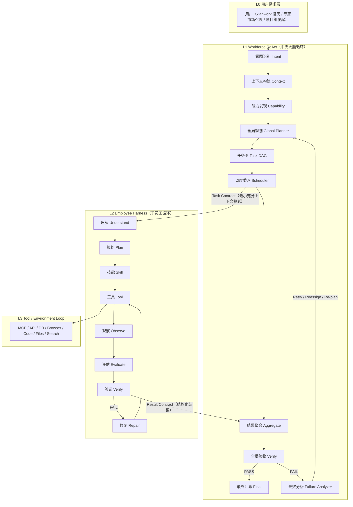
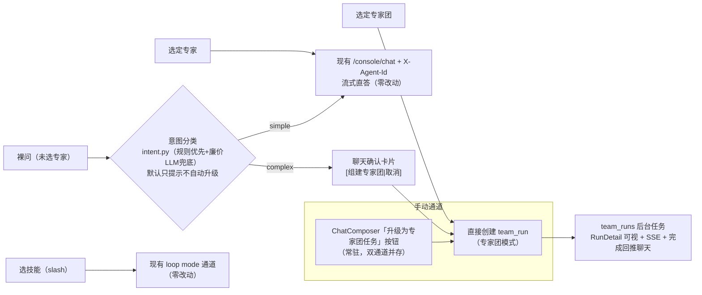
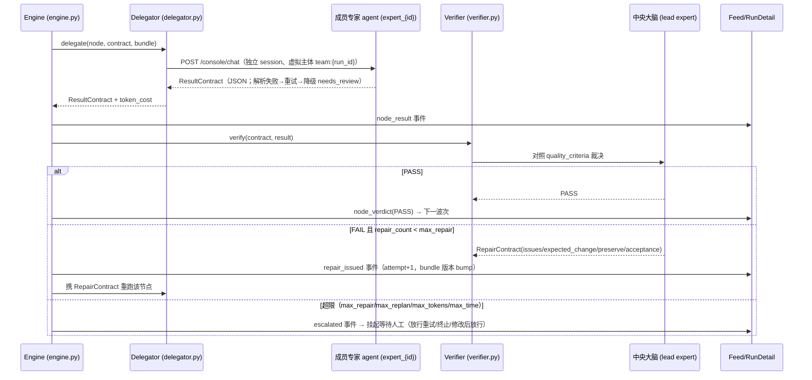
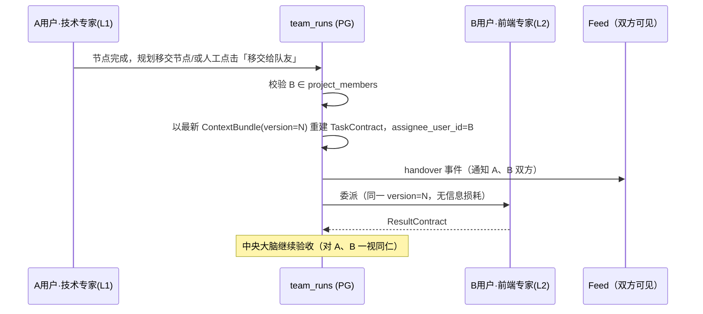

# Workforce 数字员工平台：两级 Harness 架构设计

> 日期：2026-08-18　作者：qingfeng　分支：feature/xianwork_enterprise_20260814
> 关联：alembic 0010_workforce_team_runs / changelog 20260818/02_workforce_team_runs.sql
> 需求来源：企业级可落地数字员工平台整体架构设计（用户架构方案《企业级Agent架构设计》+ 平台落地需求）

---

## 1. 设计目标与总体判断

把 QwenPaw（开源个人 AI 助手）改造为**企业级可落地的数字员工平台**：管理端（console /admin）构建专业智能体（专家）与专家团，业务端（xianwork）一人拥有多个专属数字员工；复杂需求由**中央大脑**规划、拆解、委派给**子员工**执行，并验收、返工、汇总，全过程可观察、可介入、可恢复。

依据用户架构方案的核心判断，本平台真正要建设的东西不是"Agent 本身"，而是：

> **Context + Planning + Execution + Verification + Recovery 组合起来的 Enterprise Harness（两级）。**

三个公式（引自用户方案，本设计严格遵循）：

```
Digital Employee  = Persona + Capability + Context + Harness + Memory + Permission
Harness           = Context/Planning/Execution/Evaluation/Verification/Recovery/Memory/Governance 引擎集
Digital Workforce = Workforce Brain + Digital Employees + Task Graph + Context Fabric + Enterprise Harness
```

## 2. 四层循环总架构（L0-L3）

复杂任务不是一个 ReAct，而是 **ReAct inside ReAct inside ReAct**，由 Harness 控制边界与层级。



ASCII 总图（与上图等价，便于终端阅读）：

```
┌─────────────────────────────────────────────────────────────────────┐
│                     企业数字员工 Workforce OS                        │
│                                                                     │
│  L0 用户需求层    聊天提问 / 指定专家团 / 项目组发起 / 技能召唤      │
│        ↓                                                            │
│  L1 Workforce ReAct（app/workforce/）                               │
│     Understand → Context → Capability → Plan(DAG) → Delegate       │
│          ↑                                          ↓               │
│          └── Re-plan ← Verify ← Aggregate ← Observe ─┘              │
│        ↓ Task Contract（版本化 ContextBundle 投影）                  │
│  L2 Employee Harness（已发布专家 agent = expert_{id}）              │
│     Understand → Plan → Skill → Tool → Observe → Evaluate          │
│          ↑                            ↓                             │
│          └────── Repair ← Verify ←────┘                             │
│        ↓ Result Contract（结构化回传）                               │
│  L3 Tool Loop    MCP / API / DB / Browser / Code / Files            │
└─────────────────────────────────────────────────────────────────────┘
```

**层级边界规则**：L1 不执行具体动作（只规划/委派/验收/汇总）；L2 不知道全局 DAG（只看到自己的 Task Contract 投影）；L3 是既有工具层（`react_agent` + Toolkit + 治理门，零改动）。这保证了 Token 可控、责任清晰、无上下文污染。

## 3. 双态入口路由（四入口）



- **双态并存**：简单问题单专家流式直答（现有链路不动）；复杂需求升级为后台 `team_run`——任务详情页、DAG 进度、逐节点验收/返工记录、feed 实时事件，跑完推送结果回聊天。
- **自动升级默认关闭**（可按团队维度开启），开启时 complex 判定先发可取消的确认卡片，杜绝误判打扰。
- 用户发起时**直接指定专家团 → 无条件专家团模式**（市场召唤/项目入口）。

## 4. 核心数据契约（Context Fabric）

### 4.1 三大契约 + 两个支撑对象

| 契约 | 载体 | 作用 | 落点 |
| --- | --- | --- | --- |
| **TaskContract** | `team_run_nodes.contract` JSONB | 中央大脑交给子员工的"任务事实"：目标、全局上下文快照（含版本）、父决策、依赖、期望产出、约束、验收标准、可用技能/工具 | `workforce/contracts.py` |
| **ResultContract** | `team_run_nodes.result` JSONB | 子员工结构化回传：状态、结果、证据、决策、假设、问题、置信度、是否需人工复核 | `workforce/contracts.py` |
| **RepairContract** | `team_run_nodes.repair` JSONB | 中央验收 FAIL 后的返工指令：问题清单、期望修改、需保留内容、复验标准 | `workforce/contracts.py` |
| **DagPlan / DagNode** | `team_runs.plan` JSONB | 任务图：node_key、依赖、指派专家、节点类型（task/repair/integration/final/clarify）、并行组 | `workforce/contracts.py` |
| **ContextBundle** | `team_runs.context_bundle` JSONB + `context_version` | 版本化的全局任务事实（Global/Task/Execution 三段）；**节点间/跨用户传递的唯一介质** | `workforce/bundle.py` |

### 4.2 上下文无偏差机制（本架构的核心壁垒）

1. **禁止聊天记录透传**：子员工 prompt = TaskContract 投影（objective + global_context 不可变快照 + parent_decision + 上游 ResultContract 摘要 + context_version），不含任何原始对话流。
2. **版本化事实**：全局决策变更（如技术选型确定）→ `bump_version` → 后续所有节点契约引用新版本号。子员工拿到的是"一个明确版本的任务事实"，不是"最新聊天记录"。
3. **最小充分上下文（Minimum Sufficient Context）**：每节点只获得完成自己任务所需的最小投影，Token 可控且避免信息噪声。
4. **跨用户移交零损耗**：移交 = 以最新 ContextBundle 重建 TaskContract 指派目标用户的专家，`context_version` 延续不重置——A 用户的数字员工与 B 用户的数字员工看到同一份版本化事实。

### 4.3 契约 JSON 示例

TaskContract（技术专家 → 前端专家）：

```json
{
  "task_id": "node-fe-arch",
  "objective": "设计数字员工平台前端架构",
  "global_context": {
    "context_version": 3,
    "project": "企业数字员工平台",
    "business_goal": "企业AI应用落地",
    "architecture_decision": {"frontend": "React", "backend": "FastAPI", "database": "PostgreSQL"}
  },
  "parent_decision": ["前后端分离", "统一 REST API 契约"],
  "dependencies": {"backend": "后端专家产出 API 契约（已完成，见 execution_ctx）"},
  "expected_output": ["前端架构说明", "页面清单", "组件设计"],
  "constraints": ["支持多用户权限隔离", "与后端 API 契约严格一致"],
  "quality_criteria": ["架构完整", "与总体架构一致", "API 边界明确"],
  "available_skills": ["frontend-architecture"],
  "available_tools": ["web_search", "write_file"]
}
```

ResultContract：

```json
{
  "task_id": "node-fe-arch",
  "status": "COMPLETED",
  "result": {"architecture": "…", "pages": [], "components": []},
  "evidence": ["docs/frontend-architecture.md"],
  "decisions": ["状态管理采用 zustand"],
  "assumptions": ["默认采用 REST API"],
  "issues": [],
  "confidence": 0.9,
  "needs_review": false
}
```

## 5. DAG 执行状态机

```
                       ┌────────────┐
                       │  planning  │ ← 创建 run / 携带澄清答复重入
                       └─────┬──────┘
              需求不明 ↓              ↓ DagPlan 就绪
        ┌──────────────┐        ┌──────────┐
        │awaiting_confirm│      │ running  │←──────────────┐
        └──────┬───────┘        └────┬─────┘               │
   用户答复/超时│                     │ 波次拓扑调度          │ 续跑
        └──────→ planning    ┌───────┼────────┐            │
                        节点完成│        │节点FAIL  │全部完成  │
                    ┌────────▼──┐ ┌───▼─────┐  │           │
                    │ verifying │ │repairing│  │           │
                    └────┬──────┘ └───┬─────┘  │           │
                    PASS │      超限 ↓  │复验通过│           │
              ┌──────────┼──────────┼────────┘           │
              │          │      escalated（人工介入终态）    │
              │          │  ┌────────────┐                 │
              │          └─►│aggregating │                 │
              │             └─────┬──────┘                 │
              │          汇总完成 ↓                        │
              │             ┌─────▼────┐   进程重启扫描      │
              │             │   done   │   running→interrupted
              │             └──────────┘        │
              │                          cancel │ resume
              │      ┌────────┐  ┌─────────────▼─┐
              └─────►│ failed │  │  interrupted  │
                     └────────┘  └───────────────┘
```

节点级状态机（`team_run_nodes.status`）：`pending → delegated → running → verifying → repairing → done | failed`；`attempt` 记录执行轮次（含返工轮），`repair_count` 上限由 RunPolicy 控制。

## 6. 验收-返工-熔断时序



**熔断（RunPolicy 纯计数器，不依赖模型自觉）**：`max_repair_per_node=3`、`max_replan=2`、`max_total_tokens`、`max_total_seconds`、`parallelism=2`。任一超限 → `escalated` 终态 + feed 事件 + 人工干预 API/UI（Human Escalation）。

## 7. 跨用户移交时序（项目组协同）



移交的前提是任务归属某个项目（`team_runs.project_id`），权限校验复用 `project_members` 角色体系；非项目场景 v1 不开放（显性缺口）。

## 8. Harness 8 引擎 → 代码落点映射

| 引擎 | 职责 | 落点（薄模块，非重类） | 复用既有设施 |
| --- | --- | --- | --- |
| Context Engine | 构建/投影/压缩/版本化/合并 | `workforce/bundle.py` | Scroll 上下文（子员工侧已有） |
| Planning Engine | 需求→DAG、重规划 | `workforce/planner.py` | `expert_teams.orchestration` 预置模板（0009 预留） |
| Execution Engine | 委派执行、波次调度 | `workforce/delegator.py` + `workforce/engine.py` | `agent_management` 通道、`MultiAgentManager`、专家 workspace |
| Evaluation Engine | 结果是否"看起来完成" | `workforce/verifier.py`（轻量预检） | — |
| Verification Engine | 结果是否"真正正确" | `workforce/verifier.py` | mission VERDICT 提示词范式、completion rubric |
| Recovery Engine | Retry/Repair/Reassign/Re-plan/Escalation | `workforce/engine.py` 恢复分支 + `run_store.py` 启动扫描 | PG checkpoint、`task_tracker` 停止语义 |
| Memory Engine | 任务记忆/组织记忆 | PG JSONB 快照（run/node）+ 专家 workspace 记忆 | ReMe、checkpoints（既有） |
| Governance Engine | 权限/预算/审计/人工审批 | `workforce/budget.py` + 路由层权限 | `governance/`（governor/policy/audit）、`token_usage_events` |

## 9. 17 协议 → 落点映射（Harness Runtime Specification）

| # | 协议 | 落点 |
| --- | --- | --- |
| 01 | Task Lifecycle | `engine.py` run/node 状态机 + `team_runs.status` |
| 02 | Agent Lifecycle | 既有专家发布链（`experts/publish.py`：draft→published→archived + workspace 物化 + 热加载） |
| 03 | ReAct State Machine | L2 既有 `react_agent`（零改动）；L1 由 engine 状态机承载 |
| 04 | Workforce Planning Protocol | `planner.py`（模板优先 + LLM 结构化生成 + 校验一次重生成） |
| 05 | Task Contract Protocol | `contracts.py::TaskContract` |
| 06 | Context Protocol | `contracts.py::ContextBundle` + `bundle.py`（投影/版本） |
| 07 | Skill Loading Protocol | 既有 `experts/publish.py` 技能物化 + `planner.py` 能力发现（expert_skills 权威） |
| 08 | Tool Calling Protocol | L3 既有（Toolkit + PolicyGuardedTool + ToolHookRegistry），委派通道 `agent_management` |
| 09 | Result Protocol | `contracts.py::ResultContract`（容错解析在 `delegator.py`） |
| 10 | Verification Protocol | `verifier.py`（quality_criteria 对照裁决） |
| 11 | Repair Protocol | `contracts.py::RepairContract` + engine 返工分支 |
| 12 | Re-plan Protocol | engine replan 分支（依赖受影响节点失效，max_replan 计数） |
| 13 | Memory Protocol | PG JSONB 快照（run 唯一事实）+ 既有 ReMe/workspace 记忆 |
| 14 | Checkpoint Protocol | `run_store.py` 节点边界写 checkpoint + 启动恢复扫描 |
| 15 | Human Escalation Protocol | escalated 终态 + `/runs/{id}/nodes/{key}/escalation` 干预 API + RunDetail 干预条 |
| 16 | Governance Protocol | `governance/`（复用）+ `budget.py`（run 级预算聚合）+ 路由权限 |
| 17 | Agent Trace Protocol | feed_events（kind 全集）+ run/node JSONB 全量留痕 + RunDetail 时间线 |

## 10. 并发模型与部署拓扑

- **ConcurrencyGate 三级信号量**（per-user=3 / per-tenant=50 / global=200）：团队任务以虚拟主体 `team:{run_id}` 过闸（参照 `project:{pid}` 合成主体范式），不占用发起人 per-user 配额；波次并行度 `QWENPAW_WORKFORCE_PARALLELISM`（默认 2）再限一层。
- **每个成员独立 session_id**：跨会话天然并发（UnifiedQueueManager 只串行化同一 session）。
- **v1 单 worker 拓扑**（现有部署事实）：engine 为进程内 asyncio 后台任务；崩溃恢复靠节点边界 PG checkpoint（启动扫描 running→interrupted→可续跑）。
- **水平扩展预留**：`events/bus.py` 接口刻意镜像 Redis Streams（XADD/XREAD + Last-Event-ID），多实例时替换为 RedisEventBus + PG `FOR UPDATE SKIP LOCKED` 节点认领——属部署演进，非架构重构。
- **计量**：`token_usage_events` 走内存聚合缓冲 + 节点边界批量 flush（agent_id=成员 expert，project_id=发起项目），避免每模型调用一行的写放大。

## 11. 数据模型（team_runs / team_run_nodes）

```
team_runs（一次专家团任务的运行实例）
  id / team_id / project_id? / source_chat_id? / initiator_id
  status: planning|awaiting_confirm|running|verifying|repairing|aggregating
          |done|failed|escalated|canceled|interrupted
  goal TEXT / plan JSONB(DagPlan) / policy JSONB(RunPolicy)
  context_bundle JSONB / context_version INT
  summary TEXT? / result JSONB?
  repair_count / replan_count INT
  error TEXT? / escalation_reason TEXT?
  + tenant_id / created_at / updated_at

team_run_nodes（DAG 节点的执行与验收留痕）
  (tenant_id, run_id, node_key) 主键
  assignee_expert_id / assignee_user_id?（跨用户移交）
  node_type: task|repair|integration|final|clarify
  status: pending|delegated|running|verifying|repairing|done|failed
  contract JSONB / result JSONB / repair JSONB / verdict TEXT
  repair_count INT / session_id TEXT / token_cost BIGINT / attempt INT
```

设计取舍：DAG/契约/策略全 JSONB（低频变更、与 `agent_spec` 模式一致、免频繁迁移）；不动既有 `tasks` 看板表（人工任务语义隔离）；`feed_events` 仅扩 kind 字符串无 DDL。

## 12. 与产品面的联动闭环

- **管理端（console /admin）**：专家/专家团 CRUD 与发布（已有）→ 新增 orchestration 编排配置（DAG 模板 JSON + RunPolicy 表单）→ 团队试运行 → 全租户运行视图（成本聚合/修复率/升级率）。
- **业务端（xianwork）**：聊天双态入口（升级按钮 + 意图提示）→ RunDetail 任务详情（波次分层进度、逐节点契约/结果/裁决/返工时间线、SSE 实时、escalated 干预条、移交队友）→ 项目详情页团队任务 tab → 完成汇总卡片回推聊天。
- **市场**：专家召唤计数（usage_count，已有）；专家团召唤直接创建 team_run。

## 13. 纵切端到端演练场景（验收基线）

内置"技术专家团"（技术专家 lead + 前端专家 + 后端专家，orchestration 预置 3 节点 DAG：需求分析 → 前端设计 ∥ 后端设计 → 汇总）：

1. xianwork 聊天发起"设计一个 XX 系统并输出完整技术方案"→ 升级为专家团任务；
2. 验证 DagPlan 落库、委派 prompt 投影内容（含版本化 global_context、无聊天记录透传）；
3. 验收裁决 PASS 推进；人工注入一轮 FAIL 触发 RepairContract 返工循环（attempt+1）；
4. 触发 max_repair 熔断 → escalated → 人工"放行重试"恢复；
5. 全链完成 → 汇总回写 source_chat 卡片；RunDetail 全程可视；canceled/interrupted 路径分别演练。

### 13.1 演练操作手册（可复现）

环境要求：`QWENPAW_PG_DSN` 指向的 PG 已执行 `db/feature/xianwork_enterprise_20260814/` 全量（含 0010 两表）且至少一个 LLM provider 可用。

1. **管理端建团**（console /admin/expert-teams）：
   - 创建三个专家（技术/前端/后端）并发布；
   - 创建"技术专家团"：技术专家标记 lead、三人均加入；编辑面"Workforce 编排配置"开启 `runtime_enabled`，RunPolicy 用默认值，DAG 模板粘贴：
     ```json
     [
       {"node_key":"req","deps":[],"assignee_expert_id":"<技术专家id>","node_type":"task","objective":"需求分析与拆解","expected_output":["需求清单"]},
       {"node_key":"fe","deps":["req"],"assignee_expert_id":"<前端专家id>","node_type":"task","objective":"前端设计方案","expected_output":["界面与交互方案"]},
       {"node_key":"be","deps":["req"],"assignee_expert_id":"<后端专家id>","node_type":"task","objective":"后端设计方案","expected_output":["接口与数据模型"]},
       {"node_key":"final-summary","deps":["fe","be"],"node_type":"final","objective":"汇总全部上游结果形成完整技术方案"}
     ]
     ```
   - 保存 → 发布 → 行内"试运行"（观察 run id 在管理端"Team Runs"页出现）；
2. **业务端发起**（xianwork /chat）：输入"设计一个工时填报系统并输出完整技术方案"→ 点 composer 的专家团图标 → 选团队 → 创建；时间线出现占位卡片（状态角标随 SSE 实时变化）；
3. **过程观察**（/runs/:runId）：波次分层（req → fe∥be → final）、逐节点展开可见契约（期望产出/验收标准）、结果正文、验收 PASS 角标；项目内发起时项目"团队任务"tab 同步可见；
4. **返工与熔断**：将某节点 verifier 期望调严（或直接在 DB 把 `team_run_nodes.verdict` 置 FAIL 复跑），观察返工计数/attempt 递增；连续 FAIL 达 `max_repair_per_node=3` → run=escalated → RunDetail 干预条"放行重试/终止任务"；
5. **取消与恢复**：执行中点"取消任务"（canceled）；重启后端进程 → 活跃 run 变 interrupted → "续跑"从已完成节点后恢复。

### 13.2 当前环境验证状态（诚实记录）

本分支开发环境 PG 不可达（本机无 5432 服务），端到端手册待具备 PG+LLM 的环境执行。已完成的自动化验证（全部通过）：

| 验证面 | 证据 |
| --- | --- |
| 契约校验（DAG 无环/未知依赖/重复 key/waves 分层/OrchestrationSpec Literal 严格） | `tests/integration/test_workforce_runs.py` 纯单元 8 例 |
| ResultContract 容错降级（围栏/裸 JSON/坏文本→needs_review） | 同上（并修复了裸 JSON 正则缺捕获组的真实缺陷） |
| 状态机全路径 done / repair→escalated / canceled / interrupted 续跑（LLM 接缝打桩） | 同上 PG 层 6 例（`QWENPAW_TEST_PG_DSN` 可用时执行，本环境按项目惯例 skip） |
| 权限 404 不泄露（发起人/项目成员/越权） | 同上 `_ensure_run_access` 直测 |
| 既有专家链路回归 | `test_enterprise_experts/orgs/projects` + workforce 套件 18 passed, 0 failed |
| 前端 | vitest 45 例全绿（RunDetail 状态机/节点时间线 + team_run 卡片 + 既有）；`xianwork build`、`console build` 通过 |
| 后端冒烟 | `compileall` 0 错误；admin 路由 11 条注册、xian 12 条注册 |

## 14. 显性缺口（后续迭代，禁止静默扩大）

| 缺口 | 说明 | 预留 |
| --- | --- | --- |
| 多实例水平扩展 | RedisEventBus + PG SKIP LOCKED 节点认领 | bus 接口已对齐 |
| DAG 可视化图形编辑器 | v1 用 JSON 模板 + 波次分层列表 + WavePreview 预览 | OrchestrationSpec schema 稳定 |
| 对象存储产物归档 | 团队产出文件挂 MinIO/OSS | media_files.storage_type 已预留 |
| 非项目跨用户移交 | v1 限项目组内 | assignee_user_id 字段已预留 |
| e2e Playwright | v1 以集成测试 + 手动演练准出 | e2e/ 基建已有 |
| 真实交付"一键转 showcase"沉淀 | 数据双轨已打通，转化按钮随运营反馈迭代 | showcase JSONB 一等字段 |

## 15. 内置专家体系（出厂默认 Agent）

内置专家 = 固定 `builtin_*` id 幂等 seed + 发布链物化 + 市场可见。`builtins.py` 为唯一定义源（`BUILTIN_EXPERTS` 12 个 / `BUILTIN_TEAMS` 1 个），`enterprise.py` bootstrap 挂接（失败告警不阻塞），重启不重复安装、管理员对内置行的编辑/归档不会被覆盖。

### 15.1 信息架构（对齐市场惯例，昵称零 DDL）

| 字段 | 语义 | 渲染位 |
| --- | --- | --- |
| `title` | 角色名（主标题，如"微信公众号运营专家"） | ExpertCard / 详情主标题 |
| `name` | 人格化昵称（副行，如"篇篇红"） | 卡片副行 / 详情 |
| `badge` | 官方角标（"官方"） | 标题旁 inline 徽标 |
| `usage_count` | 召唤次数（已有） | 详情头 |
| `sample_tasks` JSONB `[{title,prompt}]` | "专家帮你做"任务模板 | 详情页模板行（点击即以 prompt 为 kickoff / goal） |
| `showcase` JSONB `[{title,desc,tags[]}]` | 使用案例（静态运营位） | 详情页案例卡 |

experts / expert_teams 两表四列（alembic 0011），管理端 console 全字段可编辑（Form.List 行编辑器：模板 title+prompt、案例 title+desc+tags 逗号串），admin 路由 create/update 透传，xian 读平面 `_expert_card` / `list_expert_teams` 投影透出。

### 15.2 快慢双链（fast_nodes）

- `OrchestrationSpec.fast_nodes: List[DagNode]`（JSONB 内字段，零 DDL）；快速链是**独立完整 DAG**（含自己的 final 汇总节点）。
- 选择规则（`planner.pick_template_nodes`，纯函数可单测）：`classify_by_rules(goal)` 命中复杂信号（多交付物/跨专业/编排动词）→ 标准链 `nodes`（source=orchestration）；未命中且 fast_nodes 非空 → 快速链（source=orchestration_fast）；否则标准链兜底。source 写入 DagPlan/PlanOutcome，RunDetail 与事件可观察实际走了哪条链。
- 快速链与标准链**同一套严格校验**：OrchestrationSpec Literal schema + validate_dag（环/未知依赖）+ 成员校验 + `_ensure_final_node`，错误信息标记链来源。
- 内置软件开发团队：标准链 5 节点（requirement→architecture→implementation→qa-verify→final-summary），快速链 3 节点（fast-requirement→fast-impl→final-summary，跳过架构与 QA、总监汇总+自验兜底）。

### 15.3 使用案例双轨（静态运营 + 真实交付投影）

- **静态 showcase**：管理端可编辑、出厂内置（平台方背书的运营内容，行业惯例）；单专家与团队详情都渲染——解决"单专家无 run 概念"缺口（静态案例不依赖 run）。
- **团队真实交付投影**：TeamDetailModal 打开时 `GET /xian/workforce/runs?team_id={id}&status=done` 取前 2 条真实 run（goal+summary+交付日期），打"最近交付"徽标，与静态案例同区展示；空态文案"该团队暂无已完成任务，召唤后交付将展示在这里"；加载失败降级为提示（不阻塞静态案例）。
- 运营案例打底、真实数据佐证，二者互补；不编造数据。

### 15.4 多节点并行配置范式（fe ∥ be）

架构师拆解后 fe/be 双节点写**相同 deps** 即同波并行（engine 波次调度 + `parallelism` 限流）。示例（标准链内替换 implementation）：

```json
[
  {"node_key":"requirement","deps":[],"assignee_expert_id":"<PM>","node_type":"task","objective":"需求分析","expected_output":["验收标准"]},
  {"node_key":"architecture","deps":["requirement"],"assignee_expert_id":"<架构师>","node_type":"task","objective":"技术方案+拆解","expected_output":["任务清单"]},
  {"node_key":"fe","deps":["architecture"],"assignee_expert_id":"<前端>","node_type":"task","objective":"前端实现","expected_output":["前端代码"]},
  {"node_key":"be","deps":["architecture"],"assignee_expert_id":"<后端>","node_type":"task","objective":"后端实现","expected_output":["后端代码"]},
  {"node_key":"final-summary","deps":["fe","be"],"node_type":"final","objective":"汇总交付"}
]
```

### 15.5 WavePreview（编排波次预览，console）

`console/src/pages/Admin/WavePreview.tsx`：输入链 JSON 原文实时拓扑分层（`waveLayering` 纯函数，镜像后端 `topological_waves` / xianwork RunDetail `waveKeys`），按波渲染节点 chip——同波多节点标"并行"徽标，环/未知依赖显式报错（不被空态吞掉），JSON 非法报解析错误。标准链与快速链编辑器下方各挂一个，管理员配置 fe∥be 时所见即所得。编辑器校验器（数组/node_key 唯一/deps 存在）+ WavePreview（结构分层）+ engine 严格校验（运行时兜底）三层防线。

### 15.6 内置内容一览

- **单专家**：微信公众号运营专家（篇篇红，marketing）、内容创作专家（墨小爆，writing）——各带 3 条任务模板 + 2 条使用案例。
- **软件开发团队**（builtin_team_software）：交付总监 成必达（lead，中央大脑：只做审与合，绝不亲自写代码）、产品经理 需明白（用户故事+可验收标准）、架构师 顾大局（两案对比+并行分组建议）、工程师 码到成（按清单批量实现）、QA 严把关（结论必须附证据）；快慢双链 + 3 条任务模板 + 2 条使用案例。
- **persona 与契约呼应**：成员 system_prompt 只写领域专业性（输出格式由 delegator `_RESULT_SCHEMA_HINT` 统一注入）；QA persona 与 `ResultContract.evidence`、PM persona 与 `TaskContract.quality_criteria` 语义对齐。

---

## 16. 实现状态修正（2026-08-29，Phase 0/1 通电与 L1 回路补全）

> 本节修正前文与实现之间的落差（§13.2 的"本机无 5432"也已过时：
> 开发机 5432 已可用并跑通全量 PG 层回归）。

**Phase 0（通电，commit f6234064）**：

- **协议 08/09 通道修复**：delegator 基址改走 `_normalize_api_base_url`
  （原 `resolve_agent_api_base_url` 缺 `/api` 前缀，真实环境全部委派/
  验收/规划/汇总调用 404——引擎此前从未真实跑通的根因）。新增真实
  HTTP 自环测试（uvicorn 假 `/api/console/chat`，已做变异验证），
  此后 LLM 接缝打桩测试不再是引擎正确性的唯一证据。
- **协议 10 质量门**：final/integration 节点移除"自验收 PASS"后门，
  统一走 lead 裁决；`needs_review=True`（ResultContract 解析降级）
  强制升级人工复核，垃圾产出不得无感流入交付。
- **协议 16 治理**：xian 通道 policy 只读（请求体不可覆盖熔断策略）。
- **协议 14 恢复**：启动扫描去租户过滤（非 default 租户崩溃 run 不再
  永久卡死）；`awaiting_confirm` 排除出可中断集合（澄清流程不再被
  重启打死）。

**Phase 1（L1 回路补全）**：

- **协议 10/12 Failure Analyzer**：verifier 裁决 JSON 增加
  `failure_kind` 结构化归因（repairable / structural /
  dependency_changed）；自报 FAILED 按 结构性关键词 规则预检归因。
- **协议 12 Re-plan 接线**：dependency_changed → `_handle_replan`
  （`add_replan_count`/`reset_nodes_for_replan` 首次接入主循环；
  教训写入 `global_ctx.decisions` 并 bump 上下文版本；外层循环重入
  规划，规划 prompt 注入已完成产出摘要与既定决策）。受
  `RunPolicy.max_replan` 熔断约束，admin 面板 `replan_total` 从此真实。
- **协议 14 恢复对称**：委派/汇总通道瞬时异常 → 节点回 pending +
  run 置 interrupted（可续跑），不再整 run failed 报废已完成
  checkpoint；structural 归因 fast-fail（不再烧满返工轮）。

新增回归：`test_workforce_runs.py` 8 例（replan 全链路 / structural
fast-fail / 瞬时异常续跑 / replan 熔断 / final 验收 / needs_review
守门 / 启动恢复租户与澄清语义 / policy 只读）+ 委派通道 3 例。

**Phase 2（Context Fabric 接线，commit 9d3f04a7）**：

- **协议 06 Context Protocol**：规划成功写入拆解决策
  （`[Plan:source]`）并 bump 版本——`parent_decision` 不再恒空；
  `ContextBundle.history` 版本轨迹（有界 20 条）记录每次变更原因，
  V1→V4 演进可追溯。
- **协议 05/07**：`TaskContract.available_tools` 接真（成员
  agent_spec 启用工具映射），Skill/Tool 分离补齐 Tool 侧。

**Phase 3（能力发现 + 治理地基，commit aca0cf74）**：

- **Capability Discovery**：规划 prompt 注入成员能力档案（技能 +
  工具）；Knowledge Retrieval 入链（发起人可见 KB 轻量检索 →
  `global_ctx.knowledge`，故障静默降级）。
- **协议 16 Governance**：RBAC enforce 默认跟随认证开关（多用户
  部署默认强制）；`/api/envs`、`/api/config`、`/api/backups` 收
  `admin:platform`，`/api/models` 管理收 `model:manage`；员工自建
  专家 agent_spec 字段白名单（堵 MCP stdio 命令执行入口）。
- 预算检查前移到每轮委派前（消灭单波内超支窗口）。

**Phase 4（运行时加固，本提交）**：

- **多实例护栏**：run 认领改 PG advisory lock（专用裸连接持锁，
  免 DDL；进程死亡连接断开锁自动释放）——第二实例对同一 run 的
  启动被静默拒绝；锁通道不可用时降级放行（护栏是增强不是开关）。
- **协议 01/14 生命周期**：cancel 等待终态落库再返回（有界 10s），
  取消后滞留中间态节点回退 pending；abort 裁决保留
  escalation_reason（修复注释与实现相反的审计线索丢失）。
